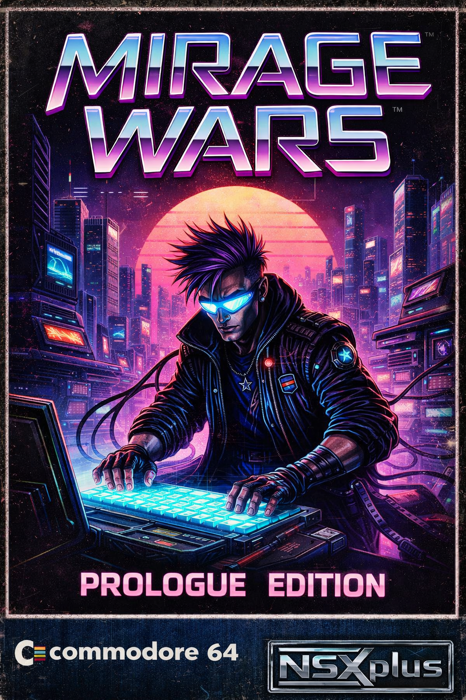

# Mirage Wars
**A game that was originally started in C# but now re(de?)-made in C64 Basic V2**

Prologue is playable on VICE or an actual C64! (Have not yet tested this)

Been wanting to get into retro computing so I decided to do my own take with the help of AI on a nice classic.

You play as Simon, a source runner for an activist group fighting back against the corrupted regime. You run and buy/sell source codes to stop the X'lithan organization from using it for their own personal gain

The prologue version has the basic game loop and is open source yall. The main finished game. Which I will dub 1.0 will have features that is not featured such as a different win/loss condition, travel to different locations, and possible combat system. Or anything that the C64 will allow 

