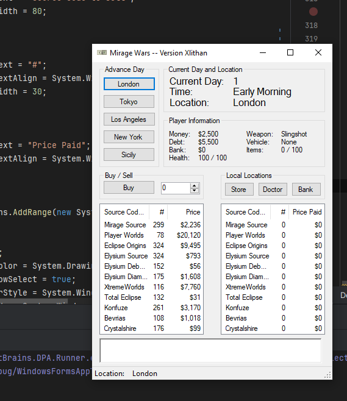

# Mirage Wars
**Game is still under development and currently unplayable (January 22, 2025)**

An interesting love letter to the Mirage Source Community. Acting as my first C# Program, this is an open source take on
a classic game from the before times. Cross-Platform will be supported and built using C# and Avalonia UI

A cyber gang have just infiltrated the mega-corporation, Xlithan and have distributed stolen source code across the
cyberspace. You have 30 days to earn 1 million dollars by selling source codes on the streets in different cities. 
Will you reach this pinnacle of success?

# MOCKUP
(Inspired by: https://github.com/danieljpetersen/drug-wars-c-sharp-gui, Final Result will look DIFFERENT)

